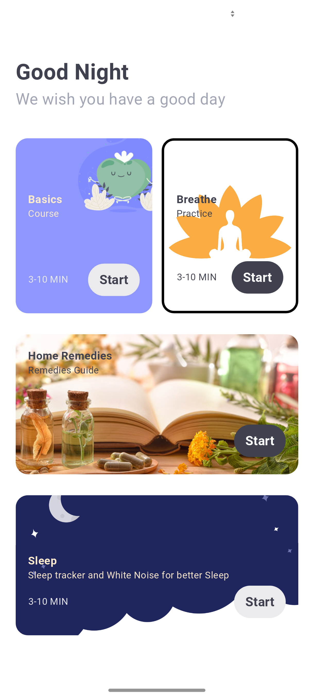
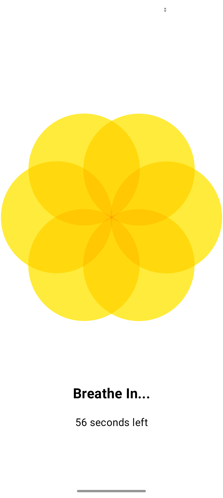
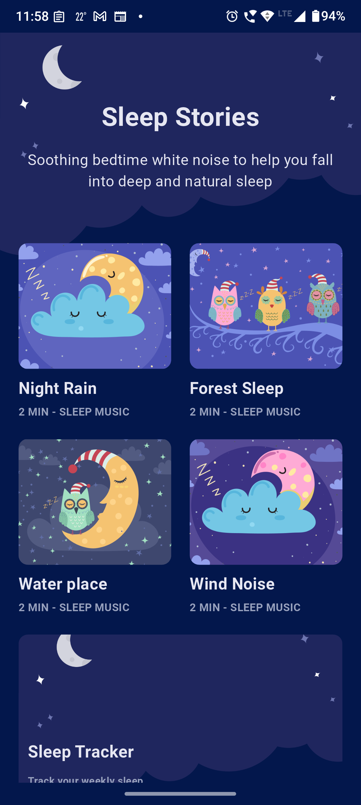
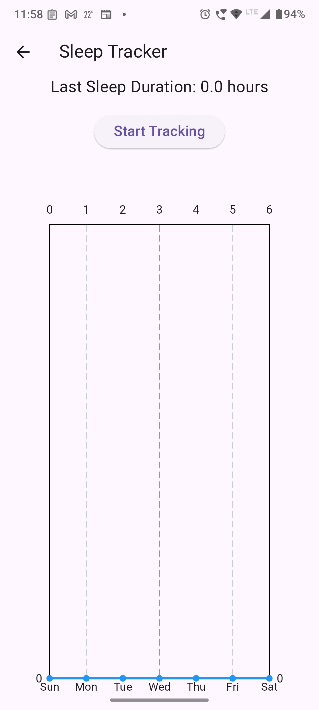

# 🌟 Migraine Helper App 🧘‍♂️💆‍♀️🎶
Your Personal Guide to Relief from Migraines! 💡
Are migraines taking over your day? Migraine Helper is here to bring you relief with scientifically-backed techniques, all in one easy-to-use app! 🌿✨

🏆 Features That Help You Find Relief
🌀 Guided Migraine Relief – Follow step-by-step techniques to ease migraine pain.
🎵 Sleep & White Noise Sounds – Relax and sleep better with soothing ambient sounds.
🌬️ Breathing Exercises – Calm your mind with guided breathing techniques.
📅 Personalized Reminders – Set reminders to follow your migraine relief routine.
📊 Progress Tracking – Monitor your well-being and see what works best for you.

🎯 Why Choose Migraine Helper?
✔️ Scientifically Proven Techniques – Backed by research to help you feel better.
✔️ User-Friendly & Minimalist Design – No distractions, just relief.
✔️ Offline Support – Get help anytime, anywhere.
✔️ Completely Free & No Ads! 🚀

📸 Screenshots
## 📸 Screenshots  

### 🏠 Home Screen  
  

### 🌬️ Breathing Exercise  
  

### 🎵 Sleep Sounds  
  

## Sleep Tracker
  

📦 Dependencies
This app is built using Flutter and the following dependencies:

🛠️ Core Dependencies
flutter_lints – Ensures best practices in Flutter development.

flutter_launcher_icons – Customize app icons.

change_app_package_name – Easily rename the package name.

🎨 UI & Animations
cupertino_icons – iOS-style icons.
flutter_svg – SVG rendering support.
lottie – Beautiful breathing animations.
waterfall_flow – A powerful staggered grid layout.
google_fonts – Elegant typography with custom fonts.

🎵 Audio & Sound Therapy
just_audio – For white noise & sleep sounds.

📊 Data Storage & Visualization
fl_chart – Graph visualization for tracking progress.
shared_preferences – Stores sleep & user data locally.

🎨 Assets
The app includes a variety of images, icons, audio files, and fonts to enhance the user experience.
📷 Images: Backgrounds, meditation guides, breathing exercises.
🎶 Audio: White noise & calming sounds.
🔤 Fonts: Roboto & Poppins for a polished UI.

🔧 How to Install & Use
1️⃣ Clone this repository:
git clone https://github.com/yourusername/migraine-helper-app.git
2️⃣ Open the project in your preferred IDE.
3️⃣ Install dependencies and run the app!

❤️ Contribute & Support
Feel free to contribute, suggest new features, or report bugs! 🙌

📧 Have feedback? Reach out at [your email/contact info]

🚀 Find relief, regain control! Try Migraine Helper today!

A few resources to get you started if this is your first Flutter project:

- [Lab: Write your first Flutter app](https://docs.flutter.dev/get-started/codelab)
- [Cookbook: Useful Flutter samples](https://docs.flutter.dev/cookbook)

For help getting started with Flutter development, view the
[online documentation](https://docs.flutter.dev/), which offers tutorials,
samples, guidance on mobile development, and a full API reference.
